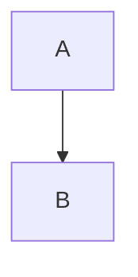
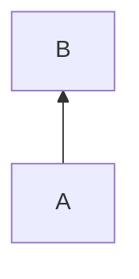

# Heutiger plan
- [x] 2 pomodoro sessions artikel lesen ~ 1 h
- [x] 2 pomodor sessions artikel lesen ~ 1 h 
- [x] laufen gehen ca. 5 km 
- [x] 2 pomodoro sessions artikel lesen ~ 1
- [x] 2 pomodoro sessions artikel lesen ~ 1
- [x] betal elregning 

# Notizen 

Sort methods by 
- metric type 
- attack types trained on and tested on 
- pros and cons 
- dataset for training and testing 
- classification type, binary or single class ? 
- detection type: anomaly, embedding, ensemble
- 
# Test graphing with mermaid

vs 

