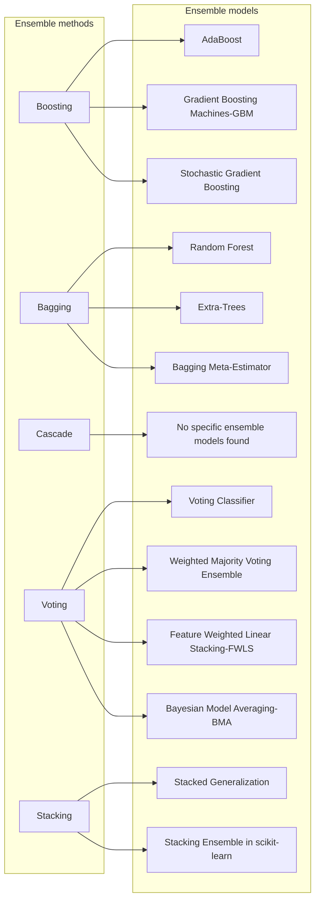

```mermaid 
flowchart LR
subgraph AA[Ensemble methods]
A[Boosting]
B[Bagging]
C[Cascade]
D[Voting]
E[Stacking]
end

subgraph BB[Ensemble models]
A1[AdaBoost]
A2[Gradient Boosting Machines-GBM]
A3[Stochastic Gradient Boosting]
B1[Random Forest]
B2[Extra-Trees]
B3[Bagging Meta-Estimator]
C1[No specific ensemble models found]
D1[Voting Classifier]
D2[Weighted Majority Voting Ensemble]
D3[Feature Weighted Linear Stacking-FWLS]
D4[Bayesian Model Averaging-BMA]
E1[Stacked Generalization]
E2[Stacking Ensemble in scikit-learn]
end

A --> A1
A --> A2
A --> A3
B --> B1
B --> B2
B --> B3
C --> C1
D --> D1
D --> D2
D --> D3
D --> D4
E --> E1
E --> E2
```

