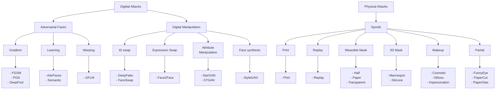

Link: https://mermaid.live/

```mermaid
flowchart TD
    A[Digitial Attacks] --> B[Adversarial Faces]
    B --> B1[Gradient]
    B --> B2[Learning]
    B --> B3[Warping]
    
    B1 -->B11[- FGSM\n- PGD \n- DeepFool]
    B2 -->B21[- AdvFaces\n- Semantic]
    B3 -->B31[- GFLM]

    A --> C[Digital Manipulation]
    C --> C1[ID swap]
    C --> C2[Expression Swap]
    C --> C3[Attribute \nManipulation]
    C --> C4[Face synthesis]
    C1 -->C11[- DeepFake\n- FaceSwap]
    C2 -->C12[- Face2Face]
    C3 -->C13[- StarGAN\n- STGAN]
    C4 -->C14[- StyleGAN]

    D[Physical Attacks]-->E[Spoofs]
    E --> E1[Print]
    E --> E2[Replay]
    E --> E3[Wearable Mask]
    E --> E4[3D Mask]
    E --> E5[Makeup]
    E --> E6[Partial]
    E1 -->E11[- Print]
    E2 -->E21[- Replay]
    E3 -->E31[- Half\n- Paper\n- Transparent]
    E4 -->E41[- Mannequin\n- Silicone]
    E5 -->E51[- Cosmetic\n- Obfusc.\n- Impersonation]
    E6 -->E61[- FunnyEye\n- PaperCut\n- PaperGlas]

```
