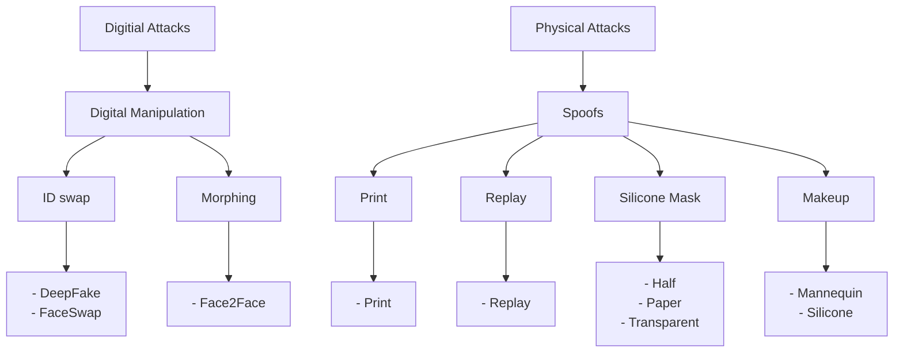

```mermaid
flowchart TD
    A[Digitial Attacks] 
    A --> C[Digital Manipulation]
    C --> C1[ID swap]
    C --> C2[Morphing]
    C1 -->C11[- DeepFake\n- FaceSwap]
    C2 -->C12[- Face2Face]

    D[Physical Attacks]-->E[Spoofs]
    E --> E1[Print]
    E --> E2[Replay]
    E --> E3[Silicone Mask]
    E --> E4[Makeup]
    E1 -->E11[- Print]
    E2 -->E21[- Replay]
    E3 -->E31[- Half\n- Paper\n- Transparent]
    E4 -->E41[- Mannequin\n- Silicone]
```
