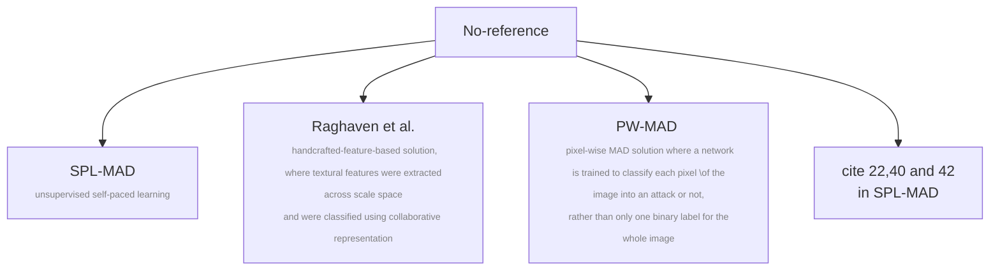

```mermaid
flowchart TD

    A[No-reference] --> A1[SPL-MAD\n<font size=1, color = #808080> unsupervised self-paced learning]

    A --> A2[Raghaven et al.\n<font size=1, color = #808080> handcrafted-feature-based solution,\n where textural features were extracted across scale space\nand were classified using collaborative representation]

    A --> A3[PW-MAD \n<font size=1, color = #808080> pixel-wise MAD solution where a network\n is trained to classify each pixel \of the image into an attack or not,\n rather than only one binary label for the whole image]

    A --> A4[cite 22,40 and 42\n in SPL-MAD]    
```

