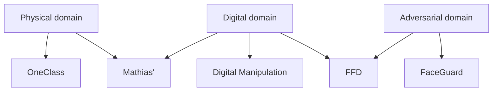

```mermaid   
flowchart TD  
    A[Physical domain]  
    B[Digital domain]  
    C[Adversarial domain]  
   
    A --> A1[OneClass]   
    
    A --> AB1[Mathias']    
    B --> AB1    
    
    B --> B1[Digital Manipulation]    
        
    B --> BC1[FFD]    
    C --> BC1    
    
    C --> C1[FaceGuard]   
```
