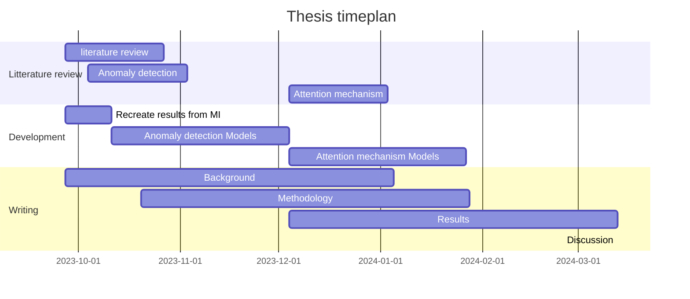
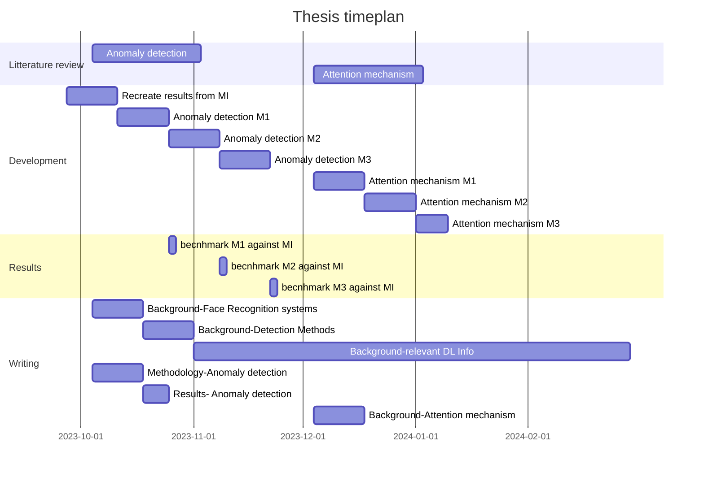

## Formal Information 

**Student's name:** Anna Maria Clara Schibelle
**Student's Institution:** DTU Compute
**Thesis title (en):** Anna Maria Clara Schibelle
**Thesis title (da):** Anna Maria Clara Schibelle
**Amount of ECTS points:** 30
**Start date:** 04.09.2023
**Due date:** 04.03.2024
**Defence date:** At DTU within 2 weeks after hand-in 
**Supervisor:** Christian D. Jensen (DTU)
**Co-Supervisors:**  Professor Christoph Busch (da-sec) and Pd.D. student Mathias Ibsen (da-sec)

# To Do 
- [ ] include facial images 
- [ ] discussion of detection methods 
- [ ] highlight not bound to anomaly just focusing on that 
- [ ] In the methodology 
      - [ ] include facial images here 
      - [ ] vision transformers as example of attention we can look at 
      - [ ] steps in anomaly detection
      - [ ] name specific solution MI 
  - [ ] 
## Motivation 
Face recognition technology has become a fundamental component of modern security systems, playing a crucial role in border control, airport security, device access, and identity verification applications. 
The widespread use of Automatic Face Recognition (AFR) systems has made it crucial to ensure the security and robustness of these systems.
One of the most critical challenges facing AFR systems is detecting various types of attacks.

These attacks can broadly fall into three domains: Presentation or Physical Attacks, Digital Attacks, and Adversarial Attacks. Presentation attacks involve using physical objects, such as masks or photos. Digital and Adversarial attacks involve manipulating digital images and videos. The goal of these manipulations is often either impersonation or obfuscation.
Within each of these domains, numerous attack types and manifestations exist. For example, in the physical domain, one attack type uses 3D masks, with manifestations like transparent silicone and standard silicone masks. 

These attack need to be detected under different circumstances; one is where a single source is available, that needs to be checked for manipulations, solutions to this problem are referred to as no-reference detection methods, on the other hand two sources might be available at detection time, that is a trusted source and an untrusted source, models regarding these situations are referred to as differential detection methods. 

- Include discussion of related works, not just mention anomaly detection as the one solution. 
- And then say that based on this you focus on anomaly but are not bound to 

Over the years, researchers and developers have made significant efforts to develop methods for detecting attacks on AFR systems. While research has made considerable progress in developing attack detection methods, most early work focused on a single domain, making them less effective in generalizing to previously unseen attacks, especially those originating from other domains. Researchers have recently shifted their research towards enhancing the generalization capabilities of AFR attack detection, which means better detection of previously unseen attacks and detection across the three domains. However, the problem of generalization is still unsolved. 

Recently, anomaly detection has shown to be a viable method for detecting attacks. This approach trains a model to learn the variations of real facial images, enabling it to identify deviations from these learned patterns as anomalies, which are then identified as attacks.
While early implementations of this approach may not have demonstrated significant improvements in detecting well-known attacks, they have shown remarkable promise in detecting previously unseen and unknown attacks.
Newer development has even been shown to beat some of the existing SOTA methods in known attacks. 

- highlight with cites: 
## Project Description 
The promising anomaly detection results form the basis for the proposed research project.
The project aims to address the current problem of generalization in Face manipulation detection, and it will do so through anomaly detection.
To achieve the primary objective, I will create and benchmark a series of detection methods against some of the recent work in anomaly detection. cite[MI, SPL-MAD]

Regarding face manipulation detection, there are two detection methods: Differential and no-reference. In differential detection, two images are available when detecting an attack; at least one is assumed to be bona fide, while the other images can be either an attack or a bona fide. In no-reference detection, only a single image is available when trying to detect an attack. Both methods have shown promising results; however, the focus would be on differential detection methods in this project. 

Furthermore, the number of attack types is significant, and to scale the project, the focus will be only on a few of these. First, the goal is to generalize well on impersonation attacks in the physical and digital domains; therefore, the adversarial domain will play a small role in this project. From these two domains, the first models will be evaluated on 2-3 attack types, and if time allows it, more attacks will be added to check generalization capabilities. 

## Tentative Research Questions
- Which anomaly detection methods from other areas can be used for attack detection in AFR systems?
- Can these anomaly detection methods surpass the current state-of-the-art detection methods?
- Can the best of the methods be further improved by attention mechanisms?
	- Conference idea: usually feature extraction after allignment (CNN)compare the two features 
	  -  new idea, erstat **CNN med vision transformer**, output er attention map og feature map, also nice due to explainability
	  - starting point, test database would be same, (do not include in RP, maybe just mention vision transformer)
## Methodology 
Some of the relevant manipulations databases are ...., these where introduced in the work done by .... 

The data used in this project comes from different sources but is based on previous work in the field. Some of the relevant databases used are listed below 
- [[XCSMAD]]
- [[CSMAD-Mobile]]
- [[HDA_MPA_DB]]
- etc. 

I will start by recreating the results from Ibsen et al. [MI] to develop an appropriate detection model. This model is then improved using alternative methods of anomaly detection. 
Further literature review on these will be done to find appropriate anomaly detection methods. 
When different anomaly detection methods have been tested and the best one identified, these will be compared to SOTA detection methods. 

The next step is to look into attention mechanisms; for this, further literature review will be done, and based on that, attention mechanisms will be added. 
The resulting models will be compared first against the original work of Ibsen et al. [MI] and afterwards to other SOTA detection methods.

attention mechanism: vision transformers 

anomaly detection steps: 
- feature extraction 
- classification 

## Tentative Timeline 
### broad 

### indepth version 

## References
- [MI]           -> [[MI Differential_Anomaly_Detection_for_Facial_Images.pdf]]
- [SPL-MAD]->[[SPL-MAD]]

