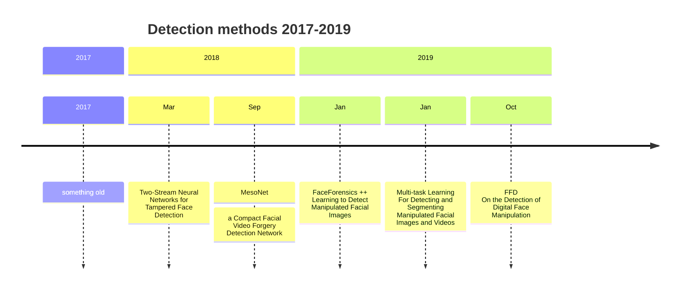
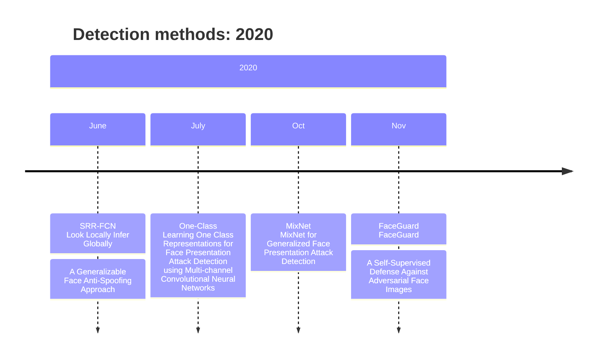
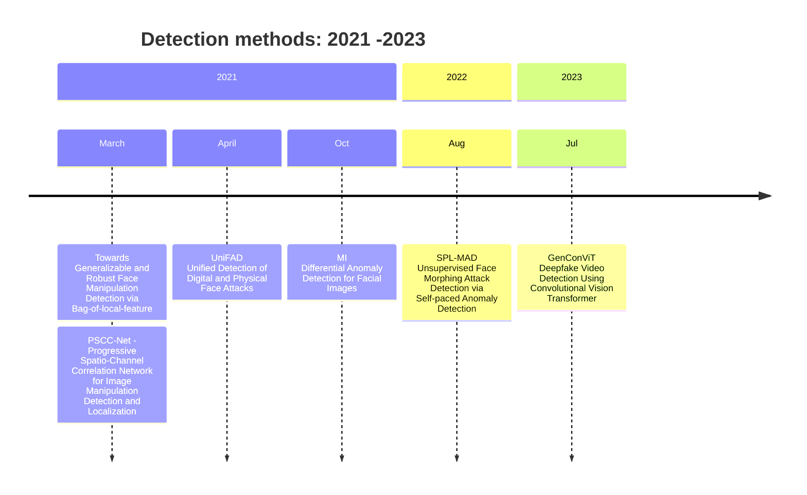
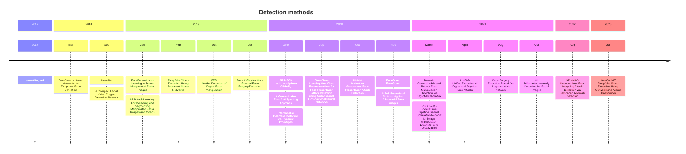

[![](https://mermaid.ink/img/pako:eNp9VdFu4joQ_RUrr9tUkLJLiVZXYkFUXS1dRLrV1RUvQzIJVhM7sh26tOq_79gJJJC7pQ-N7ficmXNmJm9eLBP0Qs_wAnMucCMY_Qw3ObI5GowNl4IVaHYy0fWhbjaDwXBc79ifXbGQaWnf5SJjMk9Y78Jte2EJit5_fJF-ZBRCwR6wUpDTP_Mi1bNmqVTsEYoSFSZsAXEnoBYlwpJQlqgl3QsZsJksSoiNvcAJ7YknKNlCqgzVoZNRw9ILcNJCfwdB0JaYrqPQPNbs0yf2dav-YT8QlLBZGtmAUj6Cl1UOpo7Wkt8XkKFuEe2Pgq1yw30D-rmFIYZjcLQCkVBiWYHCLf-K7F50GXZIFrglkjlimcIzNgK0if_SFnKNcaUoKXOpeovzk3Ki9BfzOuOfgpldtyZkyuY844YuO3NOUZ75M8e4EZH966_h4Fxdkp7sDgWq4-WeQZfGBIOOMZVAAo3Wa38xe2gMkZLklDHk-YHdixQVu8vl1i5DNj2S8VfYUmE7yimJ60ellKkVZFqWSkK8OzeLWO6FQVUqNO7mSdZWhz0HNj8IKHjMVkoaaQ5l1_TvFUUUkn7oz3LQ-qKAaJ_V-2skGk2eOAnr-neRrjrbbGoMxM8d_soZWhdVvAMhMKcmEHuZV_bcefuBxbYg-W86q-Nqni33SbNj-30YR4v6IPes8fyuApXUwKeltSPCPPWjilp7zzXBzzGlBiNPMuBCGzZN9qg0KH6sj24nRW1RDM_GSbyjeSJfiENfGG77ZC23lTb9Wr2w8htkvkz93JaSnyKYSmGvKFbRbOZbnXxreUa6aL5HFpUW0Z-dXKAWa0ga8Z2wLpm_xWBDdXVMoZ_rOi0Vz0P2S_DFtGlKek650-9_utIirXYHmltHFWvPOgUwrbJjd_ZH5Dew1lDfN6MI-oOznRPL-zqiOU-p9-zgItKpkAXkXcympi-HY8fS4DK6aPXDX7YJ67ZqaiulKt33ptcY1k1XaPQ9oLd7wfSob86alqipiKiTnvhjk9vHM_W86Z64tkePCoSmrAtUG1H_eVcerQrgCX133yznxqPRWuDGC-kxAVLX24h3eg8qI6ODiL3QqAqvvKpM6Csw55ApKLwwhVzTbgnCC9-83154ez0YTcY3o9FoOL6ZfBl8ufIOXhiMPl8P6CAY0Td6EIzHwfuV9yolIQyvg8Fk-DkYDoLReHAzuXVo_7kzS_n-B7lwp0U?type=png)](https://mermaid.live/edit#pako:eNp9VdFu4joQ_RUrr9tUkLJLiVZXYkFUXS1dRLrV1RUvQzIJVhM7sh26tOq_79gJJJC7pQ-N7ficmXNmJm9eLBP0Qs_wAnMucCMY_Qw3ObI5GowNl4IVaHYy0fWhbjaDwXBc79ifXbGQaWnf5SJjMk9Y78Jte2EJit5_fJF-ZBRCwR6wUpDTP_Mi1bNmqVTsEYoSFSZsAXEnoBYlwpJQlqgl3QsZsJksSoiNvcAJ7YknKNlCqgzVoZNRw9ILcNJCfwdB0JaYrqPQPNbs0yf2dav-YT8QlLBZGtmAUj6Cl1UOpo7Wkt8XkKFuEe2Pgq1yw30D-rmFIYZjcLQCkVBiWYHCLf-K7F50GXZIFrglkjlimcIzNgK0if_SFnKNcaUoKXOpeovzk3Ki9BfzOuOfgpldtyZkyuY844YuO3NOUZ75M8e4EZH966_h4Fxdkp7sDgWq4-WeQZfGBIOOMZVAAo3Wa38xe2gMkZLklDHk-YHdixQVu8vl1i5DNj2S8VfYUmE7yimJ60ellKkVZFqWSkK8OzeLWO6FQVUqNO7mSdZWhz0HNj8IKHjMVkoaaQ5l1_TvFUUUkn7oz3LQ-qKAaJ_V-2skGk2eOAnr-neRrjrbbGoMxM8d_soZWhdVvAMhMKcmEHuZV_bcefuBxbYg-W86q-Nqni33SbNj-30YR4v6IPes8fyuApXUwKeltSPCPPWjilp7zzXBzzGlBiNPMuBCGzZN9qg0KH6sj24nRW1RDM_GSbyjeSJfiENfGG77ZC23lTb9Wr2w8htkvkz93JaSnyKYSmGvKFbRbOZbnXxreUa6aL5HFpUW0Z-dXKAWa0ga8Z2wLpm_xWBDdXVMoZ_rOi0Vz0P2S_DFtGlKek650-9_utIirXYHmltHFWvPOgUwrbJjd_ZH5Dew1lDfN6MI-oOznRPL-zqiOU-p9-zgItKpkAXkXcympi-HY8fS4DK6aPXDX7YJ67ZqaiulKt33ptcY1k1XaPQ9oLd7wfSob86alqipiKiTnvhjk9vHM_W86Z64tkePCoSmrAtUG1H_eVcerQrgCX133yznxqPRWuDGC-kxAVLX24h3eg8qI6ODiL3QqAqvvKpM6Csw55ApKLwwhVzTbgnCC9-83154ez0YTcY3o9FoOL6ZfBl8ufIOXhiMPl8P6CAY0Td6EIzHwfuV9yolIQyvg8Fk-DkYDoLReHAzuXVo_7kzS_n-B7lwp0U)